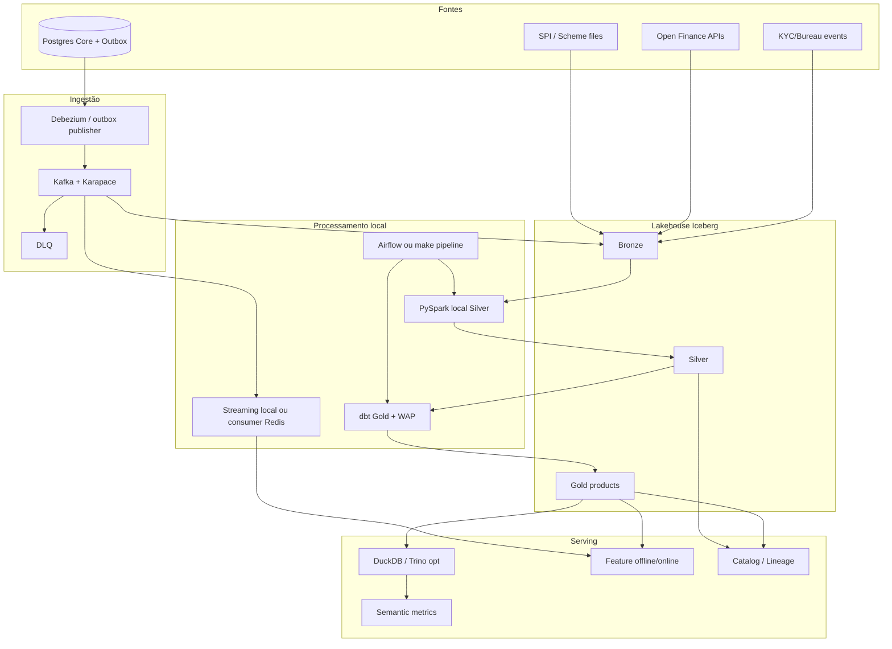

# Desafio final — Principal Data Engineer

> Completo vs grade v2 · Empresa fictícia: **NexusPay** (Instituição de Pagamento / neobank BR)

**Repo:** `engineer-data-pix-recon` (**público no GitHub** — clone → `make demo`)

**Escopo:** plataforma de dados E2E — **domínio + craft SQL + lakehouse + stream/batch + contratos + semantic layer + labels/features + SLO/FinOps + ADRs**

| | |
| --- | --- |
| Spark | **PySpark** `local[*]` (portfolio); sem cluster obrigatório |
| Fora | treinar/servir modelo ML; RAG/LLM; app de front; EMR/Databricks obrigatório |

Este briefing deve forçar você a **usar o que estudou** na trilha de Engenharia de Dados (M0–M8), não só “subir um Kafka e um Parquet”.

---

## 0. Mapa grade → o que o desafio exige

| **Módulo da grade** | **Obrigatório no desafio** |
| --- | --- |
| M0 Domínio | IP vs banco, eventos vs saldo vs arquivo, LGPD/PCI/Open Finance |
| M1 SQL/craft | Window/CTE no mart; EXPLAIN; SCD2 de conta; testes + data diff no CI |
| M2 Storage | Terraform + MinIO/S3; Medallion; Iceberg; star schema; Trino federado |
| M3 Proc/stream | **PySpark local** (skew/AQE documentado); Airflow *ou* Makefile/orquestração leve; dbt WAP; Kafka; CDC/Outbox/DLQ; velocity (Spark Structured Streaming local **ou** consumer+Redis) |
| M4 Contratos | Schema Registry; ODCS; semantic layer TPV/MED; data product + catálogo/lineage |
| M5 Domínio deep | Ledger+recon; PIX/MED; cartão/scheme; Open Finance consent; labels; KYC pipeline |
| M6 Handshake ML | Feature PIT offline+online stub; freshness vs auth SLA; feedback loop |
| M7 Confiabilidade | Máscara/delete; SLOs/error budget; runbook/postmortem; FinOps; observabilidade |
| M8 Principal | Kappa/Lambda ADR; make/buy; system design; RPO/RTO; golden path |

---

## 1. Briefing executivo

Você é o **Principal DE** da NexusPay. Herda um lake “que funciona no demo” e está sangrando confiança:

| **Incidente** | **Sintoma** | **Dono cobrando** |
| --- | --- | --- |
| INC-441 | TPV Gold ≠ SPI em **2,8%** no fechamento D-1 | CFO / Tesouraria |
| INC-452 | Chargeback D+67 órfão (sem `parent_auth_id` no hot) | Risco / Contábil |
| INC-460 | Feature `pix_velocity_1h` diverge treino×prod | Eng. ML (handoff) |
| INC-471 | Policy Open Finance usada sem join de consentimento válido | Compliance |
| INC-480 | Athena/Trino scan +40% MoM sem crescimento de conta | FinOps |

**Mandato (90 dias de roadmap comprimidos no desafio):** entregar a **plataforma canônica de pagamentos** (código → CI → deploy) com produtos de dados donos, SLOs, e golden path que outro domínio possa copiar.

- **Não é sucesso:** notebook que “bate o número uma vez”.
- **É sucesso:** contratos, WAP, lineage, runbooks, e números defensáveis sob falha.

---

## 2. Empresa e produtos (regras institucionais)

### 2.1 Tipo de instituição

- NexusPay é **Instituição de Pagamento (IP)** — não banco completo.
- Produtos: **conta de pagamento**, **PIX**, **cartão** (emissor/adquirente light), **crédito** (só onboarding/KYC+bureau no escopo de dados — sem motor de crédito), **Open Finance** (receptor de dados com consentimento).

### 2.2 Princípio contábil/analítico

1. **Evento** = fato imutável (append).
2. **Saldo** = projeção (nunca fonte da verdade).
3. **Arquivo externo** (SPI, bandeira, camt) = verdade do arranjo/parceiro.
4. **Consentimento** = pré-condição legal para ingestão Open Finance.
5. Uma **métrica canônica** tem um owner, uma SQL e um teste de recon.

### 2.3 Calendário e fusos

- Core opera em `America/Sao_Paulo`.
- Todos os eventos no lake em **UTC** (`event_time`); campos `booking_date` / `value_date` em calendário SP.
- “Dia D” de Tesouraria = `booking_date` SP, corte **23:59:59 SP**.
- Relógio de parede ≠ tempo lógico do Airflow (`data_interval`).

### 2.4 Atores e RACI (você define no ADR de ownership)

| **Data product** | **Producer** | **Consumer principal** | **SLO crítico** |
| --- | --- | --- | --- |
| `dp.pix_events_silver` | Domínio Pagamentos | Recon, Fraude, ML | lag p95 ≤ 2 min |
| `dp.card_auth_silver` | Domínio Cartões | Recon, Fraude | lag p95 ≤ 1 min |
| `dp.ledger_entries` | Domínio Ledger | Tesouraria, Contábil | completeness D+0 ≥ 99,9% |
| `dp.recon_breaks` | Domínio Recon | Tesouraria | aging >7d com owner |
| `dp.metrics_tpv` | Domínio Metrics | CFO, Produto | 1 definição |
| `dp.fraud_label_as_of` | Domínio Labels | ML / Ciência | zero leakage |
| `dp.features_pix_velocity` | Domínio Features | ML serving | online p99 ≤ 20 ms stub |
| `dp.of_consent_store` | Domínio Open Finance | qualquer join OF | só dado com consent válido |
| `dp.kyc_application` | Domínio Onboarding | Crédito/AML | retenção documentada |

---

## 3. Regras de negócio — Conta e KYC

### 3.1 Conta (`accounts`)

Campos mínimos: `account_id`, `customer_id`, `person_type` (PF|PJ), `status` (PENDING|ACTIVE|BLOCKED|CLOSED), `created_at`, `closed_at`, `kyc_level` (0–3).

**SCD2 obrigatório** em dimensão `dim_account`:

- Mudança de `status`, `kyc_level`, `person_type` gera nova versão `valid_from`/`valid_to`.
- Proibido overlap de versões (teste SQL).
- Fatos (PIX/auth) pegam `account_sk` vigente em `event_time` (as-of join).

### 3.2 KYC / onboarding

Estados: `STARTED` → `DOCS_SUBMITTED` → `BUREAU_OK|BUREAU_FAIL` → `MANUAL_REVIEW` → `APPROVED|REJECTED`.

Regras:

1. Evento `kyc_status_changed` com `application_id`, `from_status`, `to_status`, `reason_code`, `actor` (SYSTEM|ANALYST|BUREAU).
2. Documento: só **metadados** no lake (`doc_type`, `hash`, `storage_uri` cifrado) — **não** PDF/binário em Bronze analytics.
3. Bureau/SCR: payload mínimo + `consultation_id` + timestamp; retenção alinhada a política (documentar).
4. Rejeição por fraude de documento gera label candidata `KYC_FRAUD` (late confirmável).
5. Sem `APPROVED`, conta não pode ter PIX OUT (teste de invariante no Silver).

---

## 4. Regras de negócio — PIX (completas)

### 4.1 Identificadores

| **Campo** | **Regra** |
| --- | --- |
| `end_to_end_id` | Único global; imutável; chave de UPSERT |
| `txid` | Opcional conciliação E2E comércio |
| `account_id` | Conta NexusPay |
| `counterparty_ispb` / `counterparty_account` | Mascarar parcialmente em Gold |
| `amount_cents` | Inteiro; > 0 |
| `direction` | `IN` \| `OUT` |
| `initiation_type` | MANUAL \| QR \| SCHEDULED \| AUTOMATIC |

### 4.2 Máquina de estados (estrita)

```
CREATED
  → SENT (OUT) | RECEIVED (IN)
    → SETTLED
    → REJECTED
    → REFUNDED (após SETTLED)
    → MED_OPEN (após SETTLED)
      → MED_CLOSED_RETURNED | MED_CLOSED_DENIED
```

Regras:

1. Qualquer transição fora da tabela → poison → **DLQ** `pix.events.dlq` + métrica `poison_rate`.
2. `SETTLED` só uma vez; segundo `SETTLED` = retry idempotente (mesmo payload) ou conflito (DLQ `DUPLICATE_SETTLE`).
3. `REFUNDED` cria **novo** lançamento de ledger (não apaga o SETTLED).
4. `MED_OPEN` não altera TPV histórico; afeta provisão/aging separado.
5. `event_time` = instante do fato no SPI/core; `processing_time` = ingestão. Agregações de negócio usam **event_time** + watermark.

### 4.3 Limites e bloqueios (invariantes de dados)

1. Conta `BLOCKED` ou `CLOSED`: PIX OUT deve ser `REJECTED` (se vier SETTLED = incidente de qualidade).
2. Bloqueio cautelar: evento `ACCOUNT_HOLD` com `hold_id`, `amount_cents`, `reason` (MED|FRAUD|LEGAL), `expires_at`.
3. Hold libera com `ACCOUNT_HOLD_RELEASE` ou expiry — saldo disponível analítico considera holds abertos.

### 4.4 MED (Mecanismo Especial de Devolução)

1. Pode abrir até **D+80** (usar D+90 no gerador para stress).
2. Campos: `med_id`, `end_to_end_id`, `opened_at`, `closed_at`, `outcome`, `amount_cents`.
3. Cold path: eventos MED vivem em partição/cold store; join com PIX original **obrigatório**.
4. Label `MED_FRAUD=1` só quando `outcome=RETURNED` **e** tipificação fraude (campo `fraud_flag`); disponível em `closed_at`.

### 4.5 Freshness e partição Kafka

1. Tópico `pix.events` — chave de partição = `account_id` (ordem por conta).
2. Hot merchant/account: documentar risco de hot partition; salting **só** em jobs batch de agregação, não na chave de negócio.
3. Lag consumer Silver: alerta p95 > 2 min; page p99 > 5 min em business hours.

### 4.6 Arquivo SPI / extrato externo

Arquivo diário `spi_settlement_YYYYMMDD.csv` (ou JSON lines):

- `end_to_end_id`, `amount_cents`, `settlement_date`, `ispb`, `status_external`
- Gerar **1–3%** de mismatch proposital (valor, id ausente, duplicata externa)
- Recon D+0 casa Silver SETTLED × SPI do dia

---

## 5. Regras de negócio — Cartão

### 5.1 Autorização

Campos: `auth_id`, `account_id`, `merchant_id`, `mcc`, `amount_cents`, `currency=BRL`, `status` (APPROVED|DECLINED), `decline_code`, `event_time`, `channel` (POS|ECOM|WALLET).

Regras:

1. `auth_id` único.
2. DECLINED não gera lançamento de ledger de captura; pode gerar feature de tentativa.
3. PAN: só `pan_token` + `last4`; raw PAN = falha de CI se aparecer em qualquer zona.

### 5.2 Clearing / capture

1. Pode ser partial: soma de captures ≤ auth (tolerância tip **até 15%** do auth se `tip_flag=true`, senão 0%).
2. Campos: `clearing_id`, `auth_id`, `arn`, `amount_cents`, `clearing_date`, `scheme` (VISA|MC|ELO).
3. Scheme file diário (simulado) traz fees/interchange por `arn` — pipeline de **fee recon** separado (break `FEE_MISMATCH`).

### 5.3 Chargeback / dispute

1. `chargeback_id`, `arn`, `parent_auth_id`, `reason_code`, `amount_cents`, `opened_at`, `stage` (1ST|2ND|PRE_ARB).
2. Janela: **1–180 dias** após auth (dataset com D+45 e D+90).
3. Sem `parent_auth_id` no cold → `ORPHAN_CHARGEBACK` em `recon_break`.
4. Label fraude: `label=1` quando chargeback `reason_code` ∈ lista fraude **e** stage final lost; `label_available_at = opened_at` (ou closed — documentar e testar).

### 5.4 Invariantes

- Capture sem auth APPROVED → poison.
- Chargeback amount > capture liquidado → break `AMOUNT_GT_CAPTURE`.
- Refund cartão = contra-lançamento no ledger na `booking_date` corrente (não reescreve passado).

---

## 6. Regras de negócio — Ledger e conciliação

### 6.1 Plano de contas analítico (simplificado)

| **`account_code`** | **Uso** |
| --- | --- |
| CUST_BALANCE | Passivo cliente |
| SPI_SETTLEMENT | Transitória PIX |
| SCHEME_SETTLEMENT | Transitória cartão |
| FEE_EXPENSE | Tarifas |
| CHARGEBACK_LOSS | Perdas |
| MED_PROVISION | Provisão MED |

### 6.2 Lançamentos

Cada entry: `entry_id` (uuid), `account_id` (cliente ou null para transitórias), `account_code`, `side` (D|C), `amount_cents`, `booking_date`, `value_date`, `source_event_id`, `source_system`, `created_at`.

Regras de partidas dobradas (por evento de negócio):

- PIX IN SETTLED: D SPI_SETTLEMENT / C CUST_BALANCE
- PIX OUT SETTLED: D CUST_BALANCE / C SPI_SETTLEMENT
- Capture: D CUST_BALANCE / C SCHEME_SETTLEMENT (sinal conforme produto)
- Documentar matriz completa no `docs/ledger-posting-matrix.md`

**Proibido:** UPDATE de saldo; DELETE físico de entry (só reversal entry).

### 6.3 Matching engine

Ordem canônica (ADR):

1. Exact ID (`end_to_end_id` / `arn`)
2. Exact `auth_id`
3. Fuzzy: mesmo `account_id` + amount ±0 + `booking_date` ±1 — marcar `MATCH_FUZZY` e exigir review se amount > R$ 1.000

Outputs:

- `recon_match(match_id, internal_event_id, external_id, match_type, matched_at)`
- `recon_break(break_id, side, reason_code, amount_cents, opened_booking_date, age_days, owner)`

Aging buckets: 0–1, 2–7, 8–30, 31+.

KPI: matched volume D+0 ≥ **99,5%**; breaks 31+ < **0,05%** do volume mensal (meta).

### 6.4 Nostro / value-date

Simular 0,5% dos PIX com `value_date = booking_date + 1` → break de data esperado (`VALUE_DATE_GAP`), não tratado como erro de valor.

---

## 7. Regras de negócio — Open Finance

1. Tabela `of_consent`: `consent_id`, `customer_id`, `scopes[]`, `status` (AUTHORISED|REVOKED|EXPIRED), `created_at`, `expires_at`, `revoked_at`.
2. **Nenhum** dado OF no Silver sem join `consent.status=AUTHORISED` e `event_time < expires_at` e não revogado.
3. Revogação: soft-delete/máscara das cópias analíticas OF em ≤ 24h (job + teste).
4. Escopos mínimos simulados: `ACCOUNTS_READ`, `TRANSACTIONS_READ`, `CREDIT_CARDS_ACCOUNTS_READ`.
5. Pipeline OF é data product separado com owner Compliance+Dados.

---

## 8. Regras de negócio — Métricas canônicas (semantic layer)

Implementar **uma** definição versionada (dbt metric / YAML) para:

| **Métrica** | **Definição obrigatória** |
| --- | --- |
| `tpv_pix` | SUM amount SETTLED PIX por `booking_date` SP |
| `tpv_card` | SUM clearing liquidado (não auth) |
| `tpv_total` | tpv_pix + tpv_card |
| `med_open_amount` | SUM MED_OPEN não fechado |
| `chargeback_rate_30d` | chargebacks fraude / auths APPROVED 30d |
| `recon_match_rate_d0` | matched / (matched+breaks) no D+0 |
| `pix_reject_rate` | REJECTED / CREATED |

Regras:

1. Breaking change de métrica = bump major no contrato + changelog.
2. Teste de recon: `tpv_pix` Gold vs soma SPI do dia (tolerância 0 após exclude breaks abertos classificados).
3. Proibido “TPV” ad hoc em 3 notebooks diferentes.

---

## 9. Regras de negócio — Features e labels (handshake ML)

### 9.1 Feature `pix_velocity_1h`

- Definição: count de PIX SETTLED por `account_id` na janela **event_time** [t-1h, t)
- Offline: **PySpark local** window (groupBy window) com ponto-no-tempo para dataset de treino — *não* exige cluster
- Online: stub Redis/Feast-like com a **mesma** definição (contrato único)
- Stream (opcional no path quente): Spark Structured Streaming `local[*]` **ou** consumer Python Kafka→Redis; Flink só se quiser demonstrar, **não** é requisito
- Teste obrigatório: amostra onde offline(t) == online(t) ± 0

### 9.2 Outras features mínimas

- `pix_out_sum_24h`, `distinct_counterparties_7d`, `declined_auth_rate_7d`, `open_med_count`

### 9.3 Labels `fraud_label_as_of`

Campos: entity keys, `label`, `label_type`, `event_time`, `label_available_at`, `as_of`.

Teste: **zero** linhas com `label_available_at > as_of` no dataset de treino exportado.

### 9.4 Feedback loop

Tabela `fraud_case_closed`: analista confirma → evento → Bronze → label pipeline.

Não incluir “treino do modelo”; só fechar o ciclo de dado.

---

## 10. Regras de privacidade, retenção e segurança

1. Camadas: Bronze (raw) / Silver (canônico mascarado) / Gold (analytics sem PII direto).
2. Máscara dinâmica: papel `analyst` vê CPF mascarado; `fraud_ops` break-glass com audit log (pode ser simulado).
3. Iceberg DELETE MoR para atendimento LGPD na cópia analítica; ledger mínimo imutável documentado.
4. Lifecycle: Bronze > 30d → tier frio; logs de API > 7d comprimidos.
5. Terraform: bucket privado, sem ACL pública; state remoto; Checkov/OPA opcional no CI.
6. Secrets: `.env.example` only; nunca commit de key.

---

## 11. SLOs, error budgets e incidentes

| **SLO** | **Alvo** | **Error budget** |
| --- | --- | --- |
| Freshness `pix_events_silver` | p95 lag ≤ 2 min (9–22h SP) | 1h/mês acima |
| Completeness ledger D+0 | ≥ 99,9% | — |
| Schema break production | 0 breaking/mês | — |
| Recon match D+0 | ≥ 99,5% | — |
| Consent violation (OF sem consent) | 0 | — |
| PII raw em Gold | 0 | — |

Taxonomia de incidente (runbook por tipo): freshness, silent wrong, schema, permission, volume anomaly.

Obrigatório: 1 postmortem template preenchido para INC-441 (divergência TPV).

---

## 12. Stack completa (portfolio GitHub — clona e roda)

**Contrato do repo:** um revisor faz `git clone` → `cp .env.example .env` → `make demo` e vê fluxo feliz + falhas **sem** EMR, Databricks, AKS ou cluster Flink.

### 12.0 Princípio Spark (obrigatório, mas local)

| **O que** | **Como** |
| --- | --- |
| Runtime | **PySpark 3.x** com `master=local[*]` (JVM no container ou no host) |
| Onde roda | job invocado por `make spark-silver` / GitHub Actions (`runs-on: ubuntu-latest`) |
| O que prova da grade | Catalyst plan no README (`explain`), **skew** (hot `account_id`), AQE ou salting documentado |
| O que **não** exigir | YARN/K8s, multi-node, EMR, Databricks, shuffle service externo |
| Volume demo | gerador dimensionado para laptop (ver §15); CI usa amostra menor (`NEXUS_SCALE=ci`) |

Spark no desafio = **craft de Principal em modo portfolio**, não “operar cluster”.

### 12.1 Obrigatória

| **Camada** | **Tecnologia** | **Evidência no repo** |
| --- | --- | --- |
| IaC | Terraform | `terraform/` aplica MinIO/S3+IAM mock |
| Orquestração | **Airflow 2.x** *ou* `Makefile`/`scripts/run_pipeline.py` com `data_interval` | idempotência + WAP; Airflow preferível se couber na Compose |
| Stream log | Kafka KRaft | tópicos + DLQ |
| CDC/Outbox | Debezium **ou** outbox SQL+publisher | ADR + código |
| Batch / Silver pesado | **PySpark local** | `spark/jobs/` · note de skew/AQE + `explain` salvo |
| Transform Gold / SQL | **dbt** (DuckDB ou Spark SQL local) | modelos + tests + docs |
| Velocity / stream leve | Spark Structured Streaming `local[*]` **ou** consumer Python→Redis | mesma def. da feature offline |
| Lakehouse | **Iceberg** · Parquet (via PySpark **ou** pyiceberg) | time travel demo |
| Formato fio | Avro/JSON Schema | Schema Registry (**Karapace** — mais leve que Confluent full) |
| Contratos | ODCS / JSON Schema | `contracts/` · CI |
| Qualidade | dbt tests (+ GE/Soda opcional) | circuit breaker no pipeline |
| Query | **DuckDB** local; Trino **opcional** (federação) | queries versionadas |
| Semantic | dbt metrics / YAML metrics | `tpv_*` |
| Catálogo/lineage | OpenLineage **ou** export Markdown/JSON de lineage | spans ou doc+export |
| Feature | Feast **ou** Redis stub + parquet offline | contrato único |
| CI | GitHub Actions | contract, dbt, sqlfluff, **PySpark smoke**, data diff |
| Linguagem | Python tipado (mypy) + SQL | packages |
| Obs | logs estruturados (+ Prometheus opcional) | lag, poison, breaks |
| FinOps | tags + limite de scan + lifecycle rules | doc + alarme simulado |

### 12.2 Compose mínima (aceita no DoD)

Obrigatório no `docker-compose.yml`:

- Kafka (KRaft) + Karapace
- MinIO
- Postgres (core/outbox; Airflow se usar)
- Redis (feature online stub)

**Não** obrigatório (só se couber sem quebrar `make demo`): Flink, Trino, Grafana stack completa.

### 12.3 Explicitamente insuficiente (reprova)

- Só Pandas em CSV sem Iceberg/contratos
- “Precisa de cluster Spark na nuvem” para a demo funcionar
- Só Kafka sem WAP/SLO
- Sem SCD2 / sem recon / sem labels PIT
- Sem ADR Kappa/Lambda e sem runbook
- README sem instrução de clone→demo em < 30 min (máquina 8–16 GB)

### 12.4 Perfil de máquina / CI

- Dev: 8 GB RAM mínimo, 16 GB confortável
- CI: jobs Spark com dataset `ci` (ex.: 1–5% do volume §15), timeout razoável
- Artefatos: não commitar Parquet gigante; gerar no `make demo` / cache Actions

---

## 13. Arquitetura e fluxo código → deploy



```
PR (GitHub Actions)
 → sqlfluff + mypy
 → contract compatibility (backward)
 → dbt build/test (DuckDB)
 → PySpark smoke (local[*], NEXUS_SCALE=ci)
 → data-diff amostra vs baseline
merge
 → make demo (Compose + generate + silver + gold + velocity stub)
 → WAP publish Gold
 → alertas SLO + FinOps budget (simulados ok)
```

**Deploy = o que o GitHub mostra:** Actions verdes + README com screenshot/`make demo` log — não um cluster na AWS.

---

## 14. Modelo dimensional mínimo (Gold)

Fatos: `fct_pix_settled`, `fct_card_clearing`, `fct_ledger_entry`, `fct_recon_break`, `fct_med`, `fct_chargeback`

Dims SCD2: `dim_account`, `dim_merchant`, `dim_date`, `dim_consent`

Bridge: `bridge_pix_med`, `bridge_auth_chargeback`

Cada fato com `account_sk` as-of e `booking_date`.

---

## 15. Dataset sintético (gerador obrigatório)

`scripts/generate_nexuspay.py` — escala via env:

| **Perfil** | **Uso** | **Ordem de magnitude** |
| --- | --- | --- |
| `ci` | GitHub Actions | ~5–20k eventos; < 5 min Spark |
| `demo` (default) | laptop `make demo` | § abaixo (~30d) |
| `full` | stress opcional | 2–3× demo |

### Volume `demo` (30–60 dias)

| **Entidade** | **Volume** |
| --- | --- |
| accounts | ≥ 5k (PF|PJ) |
| pix events | ≥ 200k |
| card auth | ≥ 100k |
| clearing | ≥ 80% das approved |
| chargeback | 0,8–1,5% delayed |
| MED | 0,3–1% delayed |
| SPI files | 1/dia com 1–3% dirty |
| scheme fees | 1/dia |
| OF consents + transactions | ≥ 10k tx com 5% revoked mid-way |
| kyc applications | ≥ 2k |

Falhas injetadas (obrigatórias):

- retries duplicados, poison schema, **hot account skew** (para o job Spark)
- orphan chargeback, SPI missing id, value_date gap
- OF tx após revoke, CPF em campo errado (para Presidio/máscara pegar)
- volume drop 40% em 1 dia (anomaly test)

---

## 16. Estrutura do repo

```
engineer-data-pix-recon/
  README.md                 # clone → make demo (obrigatório)
  Makefile
  docker-compose.yml        # Kafka, Karapace, MinIO, Postgres, Redis (+ Airflow opt)
  .github/workflows/ci.yml  # inclui spark smoke NEXUS_SCALE=ci
  ADR/
    0001-kappa-vs-lambda.md
    0002-outbox-vs-dual-write.md
    0003-partition-key-pix.md
    0004-hot-cold-labels.md
    0005-duckdb-vs-trino.md
    0006-make-vs-buy-catalog.md
    0007-spark-local-not-cluster.md
  contracts/
  schemas/avro/
  terraform/
  airflow/dags/             # ou scripts/run_pipeline.py
  spark/
    jobs/                   # silver, velocity_offline, skew demo
    conf/spark-defaults.conf
    notes/skew-aqe.md       # explain + antes/depois
  dbt/
  feature_store/            # feast/ ou redis stub
  scripts/generate_nexuspay.py
  tests/unit/
  tests/data/
  runbooks/
  postmortems/INC-441.md
  docs/
    business-rules.md
    ledger-posting-matrix.md
    semantic-metrics.md
    raci-data-products.md
    capacity-rpo-rto.md
    portfolio.md            # o que o revisor deve olhar no GitHub
```

---

## 17. Entregáveis e rubrica Principal

### DoD (tudo obrigatório)

1. Compose sobe stack mínima; `make demo` roda fluxo feliz + falhas **em laptop** (perfil `demo`)
2. CI no GitHub Actions verde com `NEXUS_SCALE=ci` (inclui PySpark smoke)
3. ≥ 6 ADRs, incluindo **0007-spark-local-not-cluster** (por que local[*] basta para o craft)
4. Contratos + Schema Registry + CI breaking
5. Iceberg Bronze/Silver/Gold + time travel demonstrado
6. Pipeline WAP com circuit breaker (Airflow **ou** make equivalente)
7. Velocity offline (PySpark) + online stub + teste offline==online
8. **PySpark local**: Silver com skew tratado + `explain`/nota AQE no repo
9. Recon match/break/aging + fee recon
10. SCD2 accounts + as-of nos fatos
11. Open Finance consent join enforced
12. KYC events + metadados docs
13. Labels PIT anti-leakage
14. Semantic metrics TPV/MED/chargeback/recon
15. Query DuckDB (Trino opcional) documentada
16. Lineage (OpenLineage ou equivalente)
17. SLOs + alertas + FinOps lifecycle/cota
18. Runbooks + postmortem INC-441
19. Capacity/RPO/RTO one-pager
20. Golden path README (“novo domínio copia isto”) + `docs/portfolio.md`

### Rubrica (0–100)

| **Eixo** | **Peso** |
| --- | --- |
| Domínio & regras (PIX/cartão/ledger/OF/KYC) | 25 |
| Stack da grade usada de ponta a ponta **e clonável** | 20 |
| Contratos, WAP, semantic, qualidade | 15 |
| Stream/batch corretos (Kafka + PySpark local + pipeline) | 15 |
| Features/labels PIT | 10 |
| Operação Principal (SLO, FinOps, ADRs, golden path) | 15 |

**Aprovado Principal:** ≥ 85, e ≥ 20/25 no eixo domínio, e ≥ 15/20 no eixo stack.

**Penalidade automática (−15 stack):** demo que só roda com cluster cloud / Flink obrigatório sem alternativa local.

### Defesa 45–60 min

1. Evento ≠ saldo ≠ arquivo
2. Mostrar break real + aging
3. Retry não duplica TPV (prova)
4. MED/chargeback cold path
5. Consent revoke remove/mascara OF
6. velocity offline == online
7. SPI 3h atrasado: o que o SLO faz
8. Por que Kappa/Lambda (ADR)
9. Quanto custa full scan e como impediu
10. Por que Spark **local** (e não cluster) prova o craft do M3

---

## 18. Checklist final

- [ ] Gerador dirty completo (`ci` / `demo` / `full`)
- [ ] Terraform + Compose mínima
- [ ] Outbox/CDC + Kafka + DLQ
- [ ] Iceberg medallion
- [ ] **PySpark local** Silver + nota skew/AQE
- [ ] Velocity offline/online (sem Flink obrigatório)
- [ ] dbt Gold + WAP idempotente
- [ ] Contratos + Registry + CI GitHub
- [ ] SCD2 + dimensional
- [ ] Recon + fees + SPI
- [ ] OF consent + KYC
- [ ] Labels + feedback
- [ ] Semantic layer
- [ ] DuckDB (+ Trino opt) + lineage
- [ ] SLO/FinOps/runbooks/ADRs
- [ ] `make demo` one-command + Actions verdes
